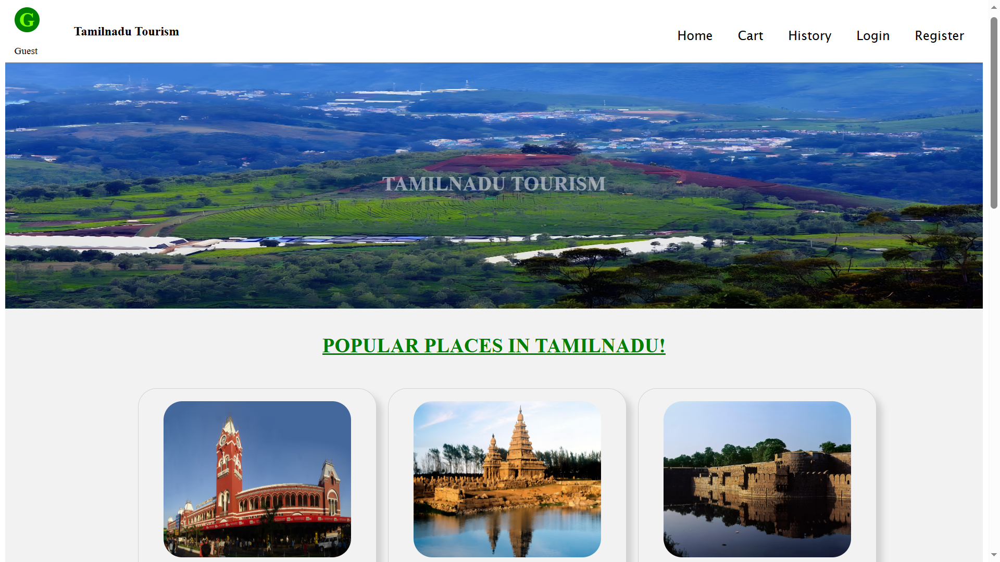
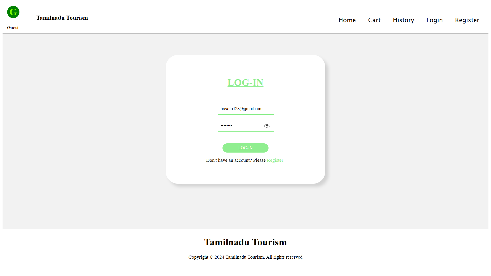
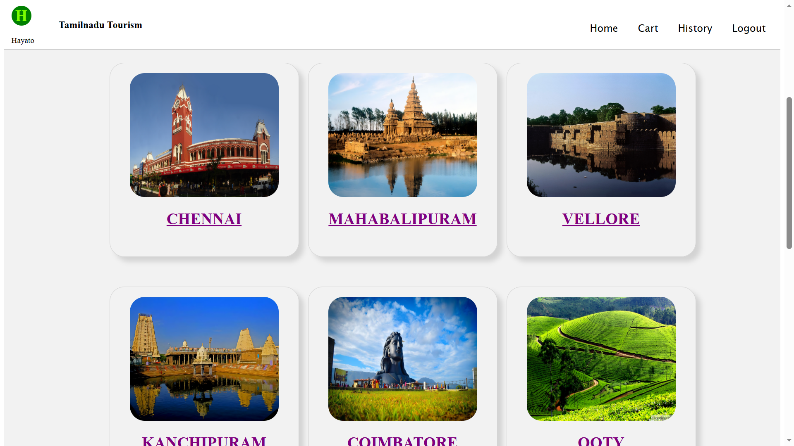
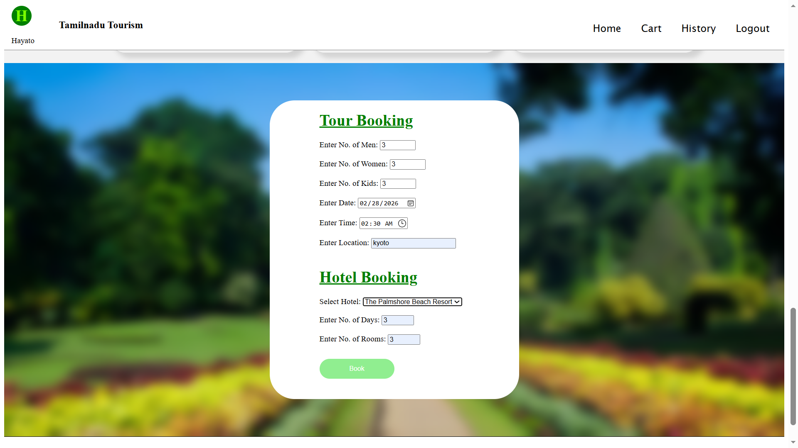
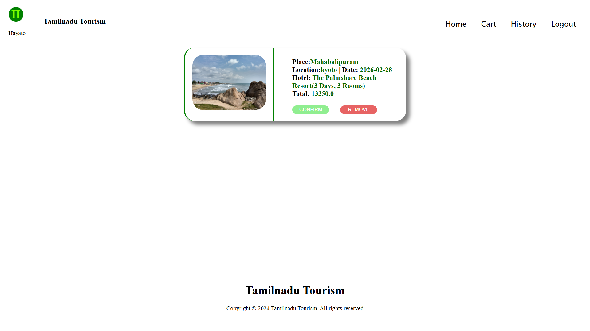
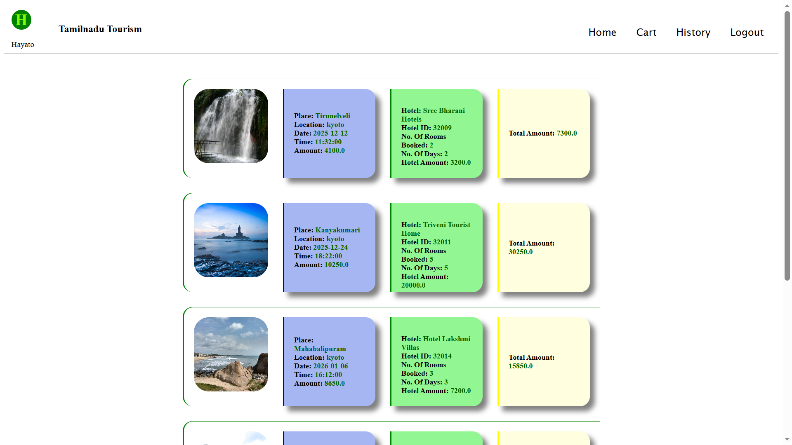

# 🌍 Tourism Management System

The **Tourism Management System** is a web-based application developed as a college mini project.  
It allows users to explore tourism packages and make bookings online, while enabling admins to manage packages and customer bookings efficiently.

---

## 🚀 Features

- User Registration and Login
- View Available Tourism Packages
- Package Booking System
- Booking Confirmation
- Admin Panel to Manage Packages
- Admin View of Customer Bookings
- MySQL Database Integration

---

## 🛠️ Technologies Used

- HTML
- CSS
- JavaScript
- Flask (Python)
- MySQL

---

## 🖥️ System Overview

This application follows a basic client-server architecture:

- Frontend: HTML, CSS, JavaScript  
- Backend: Flask (Python)  
- Database: MySQL  

The system allows users to browse packages, submit booking details, and stores booking data in the database.  
Admins can manage packages and monitor bookings.

---

## 📸 Screenshots

### 🏠 Home Page

---

### 🔑 Login Page

---
### 📦 Tourism Packages Listing

---

### 📝 Package Booking Form

---

### 🛒 Cart Page

---

### ✅ Booking Confirmation Page

---

## ⚙️ How to Run Locally

1. Install Python (3.x)
2. Install required packages:
3. Configure MySQL database and update database credentials in the project.
4. Run the Flask application:
5. Open browser and go to: http://127.0.0.1:5000/

---

## 📂 Project Type

College Mini Project  

---

## 📌 Note

This project was developed for academic purposes and runs locally using Flask and MySQL.  
It demonstrates full-stack development concepts including authentication, CRUD operations, and database integration.

---
